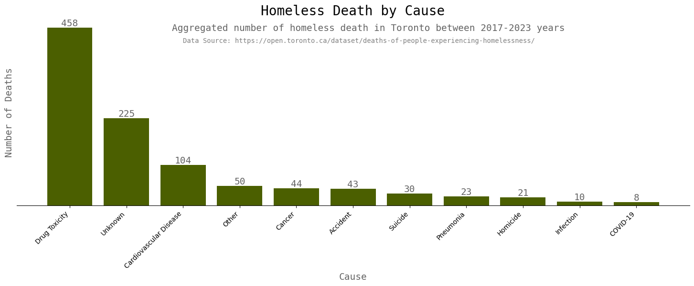

# Data Visualization

## Assignment 4: Final Project

### Requirements:
- We will finish this class by giving you the chance to use what you have learned in a practical context, by creating data visualizations from raw data. 
- Choose a dataset of interest from the [City of Toronto’s Open Data Portal](https://www.toronto.ca/city-government/data-research-maps/open-data/) or [Ontario’s Open Data Catalogue](https://data.ontario.ca/). 
- Using Python and one other data visualization software (Excel or free alternative, Tableau Public, any other tool you prefer), create two distinct visualizations from your dataset of choice. 

### My visualisations: 
For both visualisations I used the same data source, which was [Deaths of People Experiencing Homelessness](https://open.toronto.ca/dataset/deaths-of-people-experiencing-homelessness/) from City of Toronto Open Data.

**Python visualisation:** 


**Power BI visualisation:**
For Power BI visualisation, please [click here](https://app.powerbi.com/view?r=eyJrIjoiMjZlZWJlMWEtYmI4Ny00MzM2LThiMDItNjBkYjE0Zjg0NDMwIiwidCI6IjAzZGYxMTQ5LWE0MGItNDNmNy05ZTg4LWRjODk0ZjJkMjU3MCJ9)


- For each visualization, describe and justify: 
    > What software did you use to create your data visualization?
    ```
    My answer: I used Python and Power BI to create visualisations.
    ```
    > Who is your intended audience? 
    ```
    My answer: My intended audience for Python visual is Toronto municipal government. 
    For Power BI visual - online audience, residents of Toronto. 
    ```
    
    > What information or message are you trying to convey with your visualization? 
    ```
    My answer: The Python visual is conveying the message about most common causes of deaths between people experiencing homelessness. 
    The Power Bi visual showing the age range, gender distribution and overall statistics of death between people experiencing homelessness during 2017-2023 years. 

    ```
    
    > What design principles (substantive, perceptual, aesthetic) did you consider when making your visualization? How did you apply these principles? With what elements of your plots? 

    ```
    My answer: For both visuals I tried to use substantive and aesthetic design principals. I tried to make them clear and consice, using minimal visual elements, but trying to make visuals comprehensive at the same time. 
    For Python visual I used bar chart, labels, value labels, title, and titles for y and x axes. I also used subtitle to provide more context to the visual. 
    For Power BI dashboards I used different types of graphs: a bar chart, a pie chart and a line graph. I used title, and titles for x and y axes, I used ticks and labels. 
    ```
    
    > How did you ensure that your data visualizations are reproducible? If the tool you used to make your data visualization is not reproducible, how will this impact your data visualization?
    ```
    My answer: To make a Python visual reporducible, I commented all changes I made in the Jupiter notebook.
    Power BI visual is reproducible too. Reproducibility in the context of Power BI means that given the same dataset and report configuration, the visual will consistently display the same results. 
    ```
    
    > How did you ensure that your data visualization is accessible?  
    ```
    My answer: For my Python visual I used simple fonts, and one color for bars. I tried to provide description to add more context to the visual. 

    For my Power BI visual I also used simple fonts and used an accessible color scheme for all dashboard.  
    ```
    > Who are the individuals and communities who might be impacted by your visualization?  
    ```
    My answer: I hope that my visuals will have positive impact to people experiencing homelessness and addicted to substances use.
    ```
    
    > How did you choose which features of your chosen dataset to include or exclude from your visualization? 
    ```
    My answer: My dataset is not too big, so for both visuals I tried to use all features, to explore the data and make comprehensive analysis.
    ```
    
    > What ‘underwater labour’ contributed to your final data visualization product?
    ```
    My answer: People, who collected data. Designers created acceccible colour scheme for Power BI I used. 
    ```

- This assignment is intentionally open-ended - you are free to create static or dynamic data visualizations, maps, or whatever form of data visualization you think best communicates your information to your audience of choice! 
- Total word count should not exceed **(as a maximum) 1000 words** 
 
### Why am I doing this assignment?:  
- This ongoing assignment ensures active participation in the course, and assesses the learning outcomes: 
* Create and customize data visualizations from start to finish in Python
* Apply general design principles to create accessible and equitable data visualizations
* Use data visualization to tell a story  
- This would be a great project to include in your GitHub Portfolio – put in the effort to make it something worthy of showing prospective employers!

### Rubric:

| Component         | Scoring  | Requirement                                                                 |
|-------------------|----------|-----------------------------------------------------------------------------|
| Data Visualizations | Complete/Incomplete | - Data visualizations are distinct from each other<br>- Data visualizations are clearly identified<br>- Different sources/rationales (text with two images of data, if visualizations are labeled)<br>- High-quality visuals (high resolution and clear data)<br>- Data visualizations follow best practices of accessibility |
| Written Explanations | Complete/Incomplete | - All questions from assignment description are answered for each visualization<br>- Explanations are supported by course content or scholarly sources, where needed |
| Code              | Complete/Incomplete | - All code is included as an appendix with your final submissions<br>- Code is clearly commented and reproducible |

## Submission Information

🚨 **Please review our [Assignment Submission Guide](https://github.com/UofT-DSI/onboarding/blob/main/onboarding_documents/submissions.md)** 🚨 for detailed instructions on how to format, branch, and submit your work. Following these guidelines is crucial for your submissions to be evaluated correctly.

### Submission Parameters:
* Submission Due Date: `HH:MM AM/PM - DD/MM/YYYY`
* The branch name for your repo should be: `assignment-4`
* What to submit for this assignment:
    * A folder/directory containing:
        * This file (assignment_4.md)
        * Two data visualizations 
        * Two markdown files for each both visualizations with their written descriptions.
        * Link to your dataset of choice.
        * Complete and commented code as an appendix (for your visualization made with Python, and for the other, if relevant) 
* What the pull request link should look like for this assignment: `https://github.com/<your_github_username>/visualization/pull/<pr_id>`
    * Open a private window in your browser. Copy and paste the link to your pull request into the address bar. Make sure you can see your pull request properly. This helps the technical facilitator and learning support staff review your submission easily.

Checklist:
- [ ] Create a branch called `assignment-4`.
- [ ] Ensure that the repository is public.
- [ ] Review [the PR description guidelines](https://github.com/UofT-DSI/onboarding/blob/main/onboarding_documents/submissions.md#guidelines-for-pull-request-descriptions) and adhere to them.
- [ ] Verify that the link is accessible in a private browser window.

If you encounter any difficulties or have questions, please don't hesitate to reach out to our team via our Slack at `#cohort-3-help`. Our Technical Facilitators and Learning Support staff are here to help you navigate any challenges.
